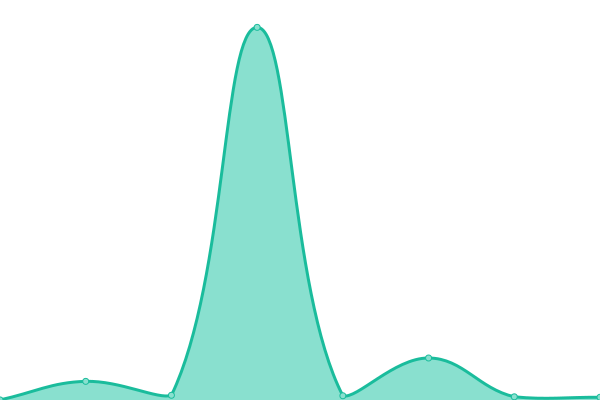
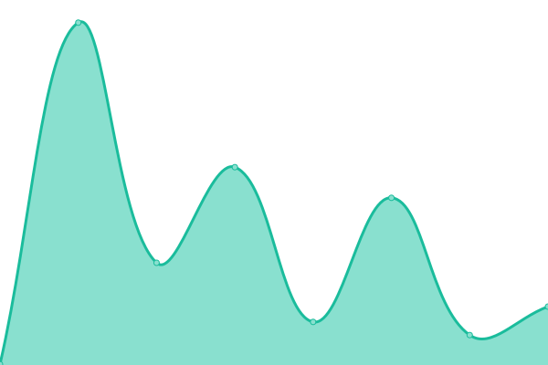
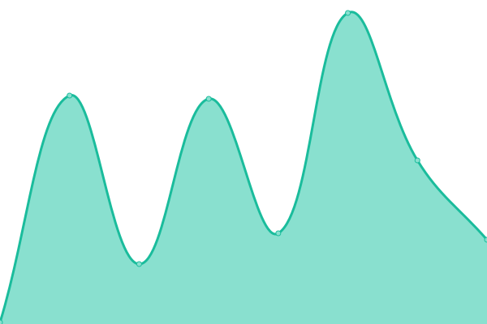

# [📈 Live Status](https://status.ganyu.rocks): <!--live status--> **🟥 Complete outage**

This repository contains the open-source uptime monitor and status page for [Wang Xiaomei](ganyu.rocks), powered by [Upptime](https://github.com/upptime/upptime).

With [Upptime](https://upptime.js.org), you can get your own unlimited and free uptime monitor and status page, powered entirely by a GitHub repository. We use [Issues](https://github.com/g2nnyS/uptime/issues) as incident reports, [Actions](https://github.com/g2nnyS/uptime/actions) as uptime monitors, and [Pages](https://status.ganyu.rocks) for the status page.

<!--start: status pages-->
<!-- This summary is generated by Upptime (https://github.com/upptime/upptime) -->
<!-- Do not edit this manually, your changes will be overwritten -->
<!-- prettier-ignore -->
| URL | Status | History | Response Time | Uptime |
| --- | ------ | ------- | ------------- | ------ |
|  [Blog](https://blog.ganyu.rocks) | 🟥 Down | [blog.yml](https://github.com/g2nnyS/uptime/commits/HEAD/history/blog.yml) | 

 197ms
     
 | 

<a href="https://status.ganyu.rocks/history/blog">0.00%</a>
    

|  [API](https://api.ganyu.rocks) | 🟥 Down | [api.yml](https://github.com/g2nnyS/uptime/commits/HEAD/history/api.yml) | 

 192ms
     
 | 

<a href="https://status.ganyu.rocks/history/api">0.00%</a>
    

|  [OSS](https://oss.ganyu.rocks/genshinimage/103266218_p0.jpg) | 🟥 Down | [oss.yml](https://github.com/g2nnyS/uptime/commits/HEAD/history/oss.yml) | 

 259ms
     
 | 

<a href="https://status.ganyu.rocks/history/oss">0.00%</a>
    

<!--end: status pages-->

[**Visit our status website →**](https://status.ganyu.rocks)

## 📄 License

- Powered by: [Upptime](https://github.com/upptime/upptime)
- Code: [MIT](./LICENSE) © [Anand Chowdhary](https://anandchowdhary.com), supported by [Pabio](https://pabio.com)
- Data in the `./history` directory: [Open Database License](https://opendatacommons.org/licenses/odbl/1-0/)
